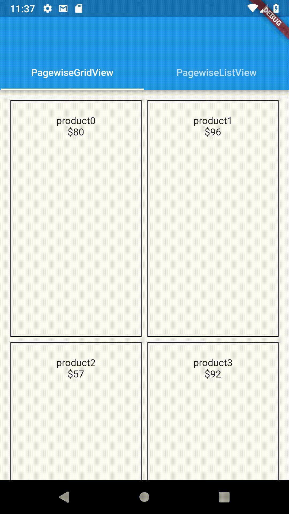

A library for widgets that load their content one page (or batch) at a time (also known as lazy-loading and pagination).



## Features
* Load data one page at a time
* Retry failed pages
* Override the default loading, retry, and error widgets if desired
* Manage loading of data more closely using a `PagewiseLoadController`
* ListView and GridView implementations
* SliverList and SliverGrid implementations
* Extendability using inheritance

## Breaking Change Starting V1.0.0:
The library has been rewritten in version 1.0.0 to provide a more
efficient implementation that does not require a `totalCount` parameter
and shows only one loading sign when users scroll down. In addition,
a new parameter has been added to `itemBuilder` callback to provide
the index if needed by the user.

## Installing the library:

Like any other package, add the library to your pubspec.yaml dependencies:
```
dependencies:
    flutter_pagewise:
```
Then import it wherever you want to use it:
```
import 'package:flutter_pagewise/flutter_pagewise.dart';
```

## Using the library

[Check out the example](./example)

The library provides the following widgets:
* `PagewiseGridView`: A pagewise implementation of [GridView](https://docs.flutter.io/flutter/widgets/GridView-class.html). It could be
used as follows:
```dart
PagewiseGridView.count(
  pageSize: 10,
  crossAxisCount: 2,
  mainAxisSpacing: 8.0,
  crossAxisSpacing: 8.0,
  childAspectRatio: 0.555,
  padding: EdgeInsets.all(15.0),
  itemBuilder: (context, entry, index) {
    // return a widget that displays the entry's data
  },
  pageFuture: (pageIndex) {
    // return a Future that resolves to a list containing the page's data
  },
);
```

* `PagewiseListView`: A pagewise implementation of [ListView](https://docs.flutter.io/flutter/widgets/ListView-class.html). It could be
used as follows:
```dart
PagewiseListView(
  pageSize: 10,
  padding: EdgeInsets.all(15.0),
  itemBuilder: (context, entry, index) {
    // return a widget that displays the entry's data
  },
  pageFuture: (pageIndex) {
    // return a Future that resolves to a list containing the page's data
  }
);
```
* `PagewiseSliverGrid`: A pagewise implementation of [SliverGrid](https://docs.flutter.io/flutter/widgets/SliverGrid-class.html). It could be used similar to `PagewiseGridView` for cases where a sliver is needed.
* `PagewiseSliverList`: A pagewise implementation of [SliverList](https://docs.flutter.io/flutter/widgets/SliverList-class.html). It could be used similar to `PagewiseListView` for cases where a sliver is needed.

The classes provide all the properties of `ListViews` and
`GridViews`. In addition, you must provide the `itemBuilder`, which
tells Pagewise how you want to render each element, and `pageFuture`,
which Pagewise calls to fetch new pages. Please note that `pageFuture`
must not return more values than mentioned in the `pageSize` parameter.

## Customizing the widget:
In addition to the required parameters, Pagewise provides you with
optional parameters to customize the widget. You have `loadingBuilder`,
`errorBuilder`, `noItemsFoundBuilder`, and `retryBuilder` to customize the widgets that show
on loading, error, no found items and retry respectively.

The `loadingBuilder` can be used as follows:
```dart
loadingBuilder: (context) {
  return Text('Loading...');
}
```

The `noItemsFoundBuilder` can be used as follows:
```dart
noItemsFoundBuilder: (context) {
  return Text('No Items Found');
}
```

The `retryBuilder` can be used as follows:
```dart
retryBuilder: (context, callback) {
  return RaisedButton(
    child: Text('Retry'),
    onPressed: () => callback()
  );
}
```
Thus, the `retryBuilder` provides you with a callback that you can
call when you want to retry.

The `errorBuilder` is only relevant when `showRetry` is set to `false`,
because, otherwise, the `retryBuilder` is shown instead. The `errorBuilder`
can be used as follows:
```dart
errorBuilder: (context, error) {
  return Text('Error: $error');
}
```

Check the classes' documentation for more details.

## Providing your own PagewiseLoadController:

Pagewise widgets manage the loading of pages using a 
`PagewiseLoadController`. This controller is responsible for fetching data,
handling errors, etc.

You don't have to provide a controller yourself when creating a Pagewise
widget. The widget will create one for you. However you might wish to create
one yourself in order to achieve some effects.

Notice though that if you provide a controller yourself, you should provide
the [pageFuture] and [pageSize] parameters to the *controller* instead of
the widget.

A possible use case of the controller is to force a reset of the loaded
pages using a [RefreshIndicator](https://docs.flutter.io/flutter/material/RefreshIndicator-class.html).
you could achieve that as follows (note that we added the `Future.value({})` as a dummy return value, because
`onRefresh` expects a `Future`, but `reset` does not return one):

```dart
final _pageLoadController = PagewiseLoadController(
  pageSize: 6,
  pageFuture: BackendService.getPage
);

@override
Widget build(BuildContext context) {
  return RefreshIndicator(
    onRefresh: () async {
      this._pageLoadController.reset();
      await Future.value({});
    },
    child: PagewiseListView(
        itemBuilder: this._itemBuilder,
        pageLoadController: this._pageLoadController,
    ),
  );
}
```

Another use case for creating the controller yourself is if you want to
listen to the state of Pagewise and act accordingly.
For example, you might want to show a snackbar when we reach the end of the list
In that case, you could do:
```dart
final _pageLoadController = PagewiseLoadController(
  pageSize: 6,
  pageFuture: BackendService.getPage
);

@override
void initState() {
  super.initState();
  this._pageLoadController.addListener(() {
    if (!this._pageLoadController.hasMoreItems) {
      Scaffold.of(context).showSnackBar(
        SnackBar(
          content: Text('No More Items!')
        )
      );
    }
  });
}
```

## Creating your own Pagewise Widgets:
You need to inherit from the `Pagewise` class. Check the code of
`PagewiseListView` and `PagewiseGridView` for examples
